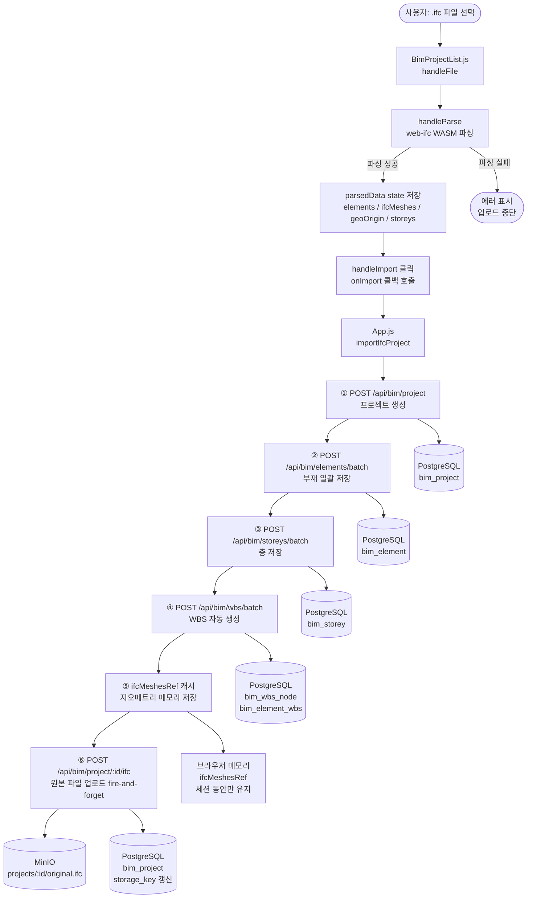
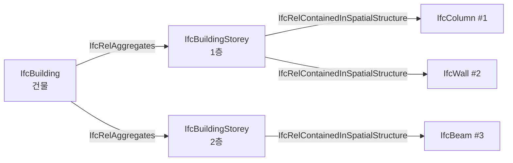
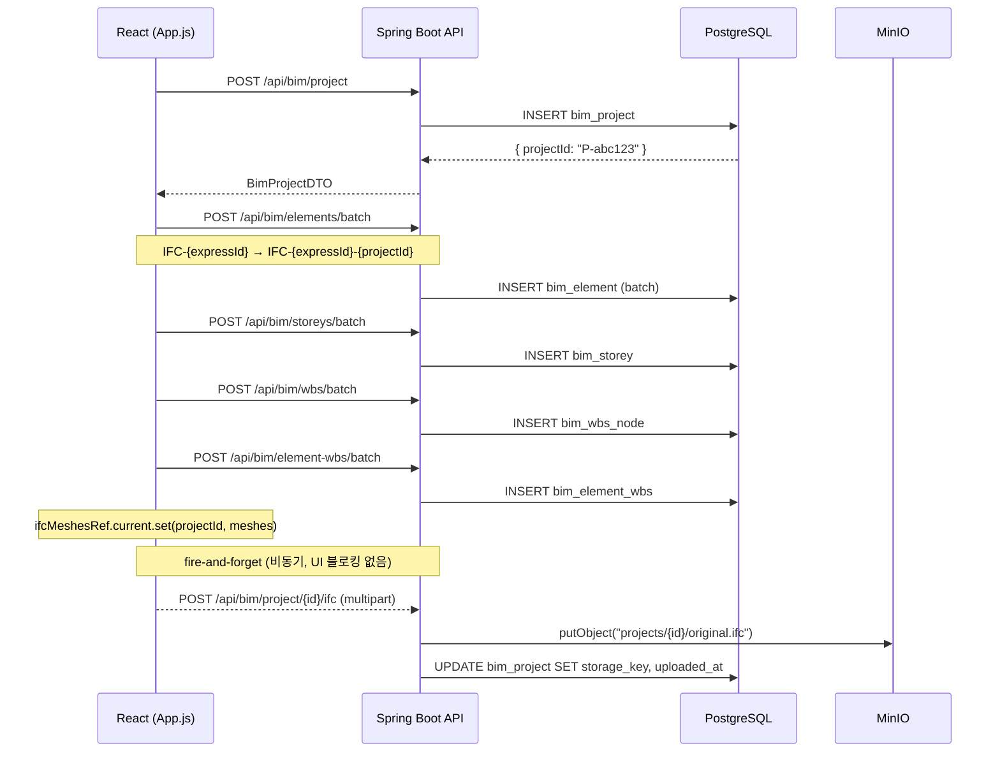

# IFC 파일을 Web BIM 뷰어에 Import하는 전체 흐름 해설

React + Spring Boot + web-ifc + MinIO 스택으로 구현한 BIM 웹 뷰어에서, 사용자가 `.ifc` 파일을 업로드하는 순간부터 3D 렌더링이 완료되고 원본 파일이 Object Storage에 영구 보관되기까지의 전 과정을 코드 기반으로 해설합니다.

## 기술 스택

| 계층 | 기술 | 역할 |
|------|------|------|
| 프론트엔드 | React 18 | UI, 상태 관리 |
| IFC 파서 | web-ifc v0.0.68 (WASM) | 브라우저 내 IFC 파싱 |
| 3D 렌더링 | Three.js v0.180 | WebGL 메시 렌더링 |
| 백엔드 | Spring Boot 3.5 + WebFlux | REST API, DB 처리 |
| ORM | MyBatis 3 | SQL 매핑 |
| DB | PostgreSQL + TimescaleDB | 메타데이터 영구 저장 |
| Object Storage | MinIO (S3 API 호환) | IFC 원본 파일 영구 보관 |

## 전체 흐름 개요



:::message
**파싱은 백엔드 없이 브라우저에서 완결됩니다.**
`web-ifc`의 WASM 모듈이 브라우저 내에서 `.ifc` 바이너리를 직접 파싱하기 때문에, 백엔드는 파싱 과정에 전혀 관여하지 않습니다.
:::

---

## Phase 1 — 파일 선택 및 유효성 검사

**파일:** `front/src/view/bim/BimProjectList.js`

사용자가 파일을 드래그앤드롭하거나 `<input type="file">`로 선택하면 `handleFile()`이 실행됩니다.

```javascript
const handleFile = useCallback((file) => {
  if (!file) return;
  // 확장자 검사
  if (!file.name.toLowerCase().endsWith(".ifc")) {
    setErrorMsg(t('ifcOnly'));
    return;
  }
  // 100MB 상한 검사
  if (file.size > 100 * 1024 * 1024) {
    setErrorMsg(t('fileTooLarge'));
    return;
  }
  setSelectedFile(file);
  // 파일명에서 프로젝트 이름 자동 설정
  if (!projectName) setProjectName(file.name.replace(/\.ifc$/i, ""));
}, [projectName, t]);
```

이 시점에서는 파일이 **메모리에 로드되지 않습니다.** `File` 객체의 참조만 `selectedFile` state에 보관됩니다.

---

## Phase 2 — IFC 파싱 (web-ifc WASM)

**파일:** `front/src/utils/ifcImporter.js`

[파일 분석] 버튼을 클릭하면 `parseIfcFile()`이 호출됩니다. 이 함수가 전체 흐름의 핵심입니다.

```javascript
export async function parseIfcFile(file, onProgress, userScale = 1.0) {
  const ifcAPI = new IfcAPI();
  ifcAPI.SetWasmPath((process.env.PUBLIC_URL || '') + '/', true);
  await ifcAPI.Init(); // WASM 초기화

  const buffer = await file.arrayBuffer(); // 파일 전체를 메모리에 로드
  const modelId = ifcAPI.OpenModel(new Uint8Array(buffer));
  // ...
  ifcAPI.CloseModel(modelId); // ← 여기서 WASM 메모리 해제
}
```

내부적으로 다음 5단계로 나뉩니다.

### 2-1. 단위 스케일 감지

```javascript
function detectUnitScale(ifcAPI, modelId) {
  const unitIds = ifcAPI.GetLineIDsWithType(modelId, IFCSIUNIT, false);
  for (let i = 0; i < unitIds.size(); i++) {
    const unit = ifcAPI.GetLine(modelId, unitIds.get(i), false);
    if (unit?.UnitType?.value === 'LENGTHUNIT') {
      const prefix = unit.Prefix?.value;
      if (prefix === 'MILLI') return 0.001; // mm → m
      if (prefix === 'CENTI') return 0.01;  // cm → m
      return 1.0; // 기본값: m
    }
  }
  return 1.0;
}
```

`IfcSIUnit`을 파싱해 길이 단위 prefix를 확인합니다. 한국 건설 현장 IFC 파일은 대부분 mm 단위(`MILLI`)이므로 scale = `0.001`이 됩니다.

### 2-2. 위치 정보 (GeoOrigin) 추출

```javascript
// IfcSite에서 위경도/표고 파싱
const site = ifcAPI.GetLine(modelId, siteIds.get(0), true);
const latitude  = dmsToDecimal(site.RefLatitude?.value);  // DMS → decimal
const longitude = dmsToDecimal(site.RefLongitude?.value);
const elevation = site.RefElevation?.value ?? null;
```

`IfcSite`의 `RefLatitude` / `RefLongitude`는 도분초(DMS) 배열로 저장되므로 `dmsToDecimal()`로 십진도(decimal degrees)로 변환합니다. GIS 연동에 사용됩니다.

### 2-3. 공간 구조 추출 (층·동 계층)



```javascript
// Step 3: IfcRelAggregates → 층(storeyId) ↔ 건물(buildingId) 매핑
// Step 4: IfcRelContainedInSpatialStructure → expressId ↔ {storey, building}
const elemToSpatial = new Map(); // expressId → { storey, building }
```

이 매핑은 나중에 `bim_element.storey`, `bim_element.building` 컬럼에 저장됩니다.

### 2-4. 부재 타입 매핑

원본 IFC 타입과 내부 타입의 매핑 관계입니다.

| 원본 IFC 타입 | 내부 저장 타입 | 비고 |
|------|------|------|
| `IfcColumn` | `IfcColumn` | 1:1 |
| `IfcBeam` | `IfcBeam` | 1:1 |
| `IfcWall`, `IfcWallStandardCase` | `IfcWall` | 통합 |
| `IfcSlab` | `IfcSlab` | 1:1 |
| `IfcMember`, `IfcPlate` | `IfcMember` | 통합 |
| `IfcFooting` | `IfcSlab` | 기초→슬래브로 분류 |
| `IfcPile` | `IfcPier` | 커스텀 타입 |
| `IfcDoor` | `IfcDoor` | 1:1 |
| `IfcWindow` | `IfcWindow` | 1:1 |
| `IfcStair`, `IfcStairFlight` | `IfcStair` | 통합 |
| `IfcRoof` | `IfcRoof` | 1:1 |

:::message alert
`IfcWallStandardCase`와 `IfcWall`이 동일한 타입으로 통합되는 등 **일부 원본 타입 정보가 손실**됩니다. IFC Export 시 완전한 round-trip을 위해서는 `ifc_original_type` 컬럼 추가가 필요합니다.
:::

### 2-5. 지오메트리 스트리밍 (핵심)

```javascript
ifcAPI.StreamAllMeshesWithTypes(modelId, uniqueTypes, (mesh) => {
  for (let g = 0; g < mesh.geometries.size(); g++) {
    const geom = mesh.geometries.get(g);
    const mat  = geom.flatTransformation; // 4×4 변환 행렬

    const geomData = ifcAPI.GetGeometry(modelId, geom.geometryExpressID);
    const verts = ifcAPI.GetVertexArray(geomData.GetVertexData(), geomData.GetVertexDataSize());
    // verts 구조: [x, y, z, nx, ny, nz, x, y, z, nx, ny, nz, ...]

    for (let vi = 0; vi < vertCount; vi++) {
      const [wx, wy, wz] = transformPoint(mat, lx, ly, lz); // IFC Z-up 월드 좌표
      const tx = wx * scale;  // Three.js X
      const ty = wz * scale;  // Three.js Y (IFC Z → Three.js Y)
      const tz = wy * scale;  // Three.js Z (IFC Y → Three.js Z)
    }
  }
});
```

**좌표계 변환이 여기서 발생합니다.**

```text
IFC 좌표계 (Z-up)     Three.js 좌표계 (Y-up)
       Z                      Y
       │                      │
       │                      │
       └──── Y      →         └──── X
      ╱                      ╱
     X                      Z

 IFC(x, y, z)  →  Three.js(x*scale, z*scale, y*scale)
```

각 부재의 `positions`, `normals`, `indices`가 `Float32Array` / `Uint32Array`로 메모리에 구성됩니다.

파싱이 완료되면 전체 중앙 정렬(center normalization)이 수행됩니다.

```javascript
// 전체 모델의 중앙을 Three.js 원점(0,0,0)으로 이동
const cx = (minX + maxX) / 2;
for (const el of elements) {
  el.positionX -= cx;
  el.positionY -= actualMinZ;
  el.positionZ -= minZ;
}
```

`geoOrigin`에 offset 값이 저장되어 나중에 IFC 원본 좌표 역산이 가능합니다.

### parseIfcFile 반환값

```javascript
return {
  elements: [           // DB에 저장되는 메타데이터
    {
      elementId:   "IFC-12345",
      elementType: "IfcColumn",
      positionX/Y/Z,    // Three.js 정규화 좌표
      sizeX/Y/Z,        // 바운딩박스 크기
      ifcWorldX/Y/Z,    // IFC Z-up 원본 좌표 (GIS용)
      globalId:    "2O2Fr$t4X7Zf8NOew3FLOH",
      ifcName:     "기둥-1",
      storey:      "1층",
      building:    "A동",
    },
    // ...
  ],
  ifcMeshes: [          // 브라우저 메모리에만 유지
    {
      expressId:   12345,
      elementId:   "IFC-12345",
      positions:   Float32Array, // 정점 좌표
      normals:     Float32Array, // 법선 벡터
      indices:     Uint32Array,  // 삼각형 인덱스
      color:       [r, g, b, a],
    },
    // ...
  ],
  geoOrigin: {
    latitude:   37.123456,  // IfcSite
    longitude:  127.123456,
    elevation:  45.0,
    ifcOffsetX: 125.3,      // 역산용 오프셋
    ifcOffsetY: 0.12,
    ifcOffsetZ: 8.5,
    scale:      0.001,      // mm → m
  },
  storeys: [
    { name: "1층", elevation: 0, building: "A동", elementIds: ["IFC-12345", ...] },
  ],
  detectedScale: 0.001,
};
```

:::message
`ifcMeshes`의 `Float32Array` 지오메트리 데이터는 **DB에 저장되지 않습니다.** 브라우저 세션 동안만 `ifcMeshesRef`에 유지되며, 새로고침하면 소실됩니다. MinIO에 원본 `.ifc`를 보관하는 이유가 여기에 있습니다.
:::

---

## Phase 3 — 프로젝트 생성 및 데이터 저장

**파일:** `front/src/App.js` → `importIfcProject()`

파싱 결과를 받아 백엔드 API를 **순차 호출**합니다.



### 3-1. 프로젝트 생성

```javascript
const projectRes = await AxiosCustom.post('/api/bim/project', {
  structureType: type,
  projectName: uniqueName,
  spanCount: 0,
  geoLatitude:  geoOrigin.latitude,
  geoLongitude: geoOrigin.longitude,
  geoElevation: geoOrigin.elevation,
  ifcOffsetX:   geoOrigin.ifcOffsetX,
  ifcOffsetY:   geoOrigin.ifcOffsetY,
  ifcOffsetZ:   geoOrigin.ifcOffsetZ,
  ifcScale:     geoOrigin.scale,
});
const project = projectRes.data; // { projectId: "P-abc123", ... }
```

이름 중복 시 `"프로젝트명 (2)"`, `"프로젝트명 (3)"` 형식으로 자동 증가합니다.

### 3-2. 부재 일괄 저장

`elementId`에 `projectId` suffix를 붙여 **PK 충돌을 방지**합니다.

```javascript
const payload = elements.map(el => {
  const newId = `${el.elementId}-${project.projectId}`;
  idMap[el.elementId] = newId; // 이후 WBS 매핑에 사용
  return { ...el, projectId: project.projectId, elementId: newId };
});
await AxiosCustom.post('/api/bim/elements/batch', payload);
```

백엔드 MyBatis 쿼리:

```xml
<!-- BimMapper.xml -->
<insert id="insertElementsBatch">
  INSERT INTO bim_element (
    element_id, project_id, element_type, material,
    position_x, position_y, position_z,
    size_x, size_y, size_z,
    rotation_x, rotation_y, rotation_z,
    ifc_world_x, ifc_world_y, ifc_world_z,
    global_id, ifc_name, storey, building
  ) VALUES
  <foreach collection="list" item="e" separator=",">
    (#{e.elementId}, #{e.projectId}, #{e.elementType}, ...)
  </foreach>
  ON CONFLICT (element_id) DO NOTHING
</insert>
```

### 3-3. WBS 자동 생성

```javascript
const { generateWbsFromElements } = await import('./utils/wbsGenerator');
const { wbsNodes, mappings } = generateWbsFromElements(renamedElements, project.projectId);
```

IFC의 공간 계층 구조를 바탕으로 WBS 트리가 자동 생성됩니다.

```text
PROJECT (프로젝트 루트)
└── BUILDING (A동)
    ├── STOREY (1층)
    │   ├── TASK (IfcColumn 공종) — element_count: 12
    │   ├── TASK (IfcBeam 공종)   — element_count: 8
    │   └── TASK (IfcWall 공종)   — element_count: 24
    └── STOREY (2층)
        └── ...
```

### 3-4. 지오메트리 메모리 캐시

```javascript
// DB에 저장하지 않고 React ref에 보관
ifcMeshesRef.current.set(project.projectId, renamedMeshes);
```

`ifcMeshesRef`는 `useRef`로 관리되어 리렌더링 없이 Three.js 씬에 직접 전달됩니다.

---

## Phase 4 — IFC 원본 파일 Object Storage 업로드

이 단계는 `await` 없이 **fire-and-forget**으로 실행됩니다. 업로드 실패가 프로젝트 생성 흐름 전체를 막지 않습니다.

```javascript
// App.js — fire-and-forget
if (ifcFile && project?.projectId) {
  const formData = new FormData();
  formData.append('file', ifcFile);
  AxiosCustom.post(`/api/bim/project/${project.projectId}/ifc`, formData, {
    headers: { 'Content-Type': 'multipart/form-data' },
  })
    .then(() => console.log(`[IFC] 원본 파일 업로드 완료: ${project.projectId}`))
    .catch(e  => console.warn('[IFC] 원본 파일 업로드 실패(무시):', e?.message));
}
```

백엔드에서의 처리 흐름입니다.

```java
// BimController.java
@PostMapping(value = "/project/{projectId}/ifc",
             consumes = MediaType.MULTIPART_FORM_DATA_VALUE)
public ResponseEntity<Map<String, String>> uploadIfcFile(
        @PathVariable String projectId,
        @RequestParam("file") MultipartFile file) {
    String storageKey = bimService.uploadIfcFile(projectId, file);
    return ResponseEntity.ok(Map.of("storageKey", storageKey, ...));
}
```

```java
// BimServiceImpl.java
@Override
public String uploadIfcFile(String projectId, MultipartFile file) {
    String key = "projects/" + projectId + "/original.ifc";

    // 1. MinIO에 업로드
    storageService.upload(key, file.getInputStream(), file.getSize(),
                          "application/octet-stream");

    // 2. DB에 storage_key 저장
    Map<String, Object> params = new HashMap<>();
    params.put("projectId",        projectId);
    params.put("storageKey",       key);
    params.put("originalFilename", file.getOriginalFilename());
    bimDAO.updateProjectStorage(params);

    return key;
}
```

`StorageService`는 인터페이스로 추상화되어 있어 MinIO → AWS S3 교체 시 구현체만 바꾸면 됩니다.

```java
// StorageService.java — 인터페이스
public interface StorageService {
    String upload(String key, InputStream is, long size, String contentType);
    InputStream download(String key);
    void delete(String key);
    boolean exists(String key);
}
```

MinIO에는 다음 경로로 저장됩니다.

```text
bucket: twinspring
└── projects/
    └── {projectId}/
        └── original.ifc   ← 원본 IFC 바이너리
```

---

## Phase 5 — 3D 렌더링

**파일:** `front/src/view/bim/element/IFCMeshGroup.jsx`

`ifcMeshes`를 받아 Three.js `BufferGeometry`를 구성합니다.

```jsx
// IFCMesh 컴포넌트 (Three.js BufferGeometry 직접 구성)
const geometry = useMemo(() => {
  const geo = new THREE.BufferGeometry();
  geo.setAttribute('position',
    new THREE.BufferAttribute(mesh.positions, 3));
  geo.setAttribute('normal',
    new THREE.BufferAttribute(mesh.normals, 3));
  geo.setIndex(
    new THREE.BufferAttribute(mesh.indices, 1));
  return geo;
}, [mesh.positions, mesh.normals, mesh.indices]);
```

`positions`는 `Float32Array`이므로 복사 없이 GPU 버퍼에 직접 바인딩됩니다.

---

## 저장 위치 최종 정리

```text
┌─────────────────┬───────────────────────────┬─────────────────────────┐
│ 저장 위치        │ 저장 데이터                │ 보존 기간               │
├─────────────────┼───────────────────────────┼─────────────────────────┤
│ PostgreSQL       │ bim_project               │ 영구                    │
│ (bim_project)    │ - projectId, projectName  │                         │
│                  │ - geoLatitude/Longitude   │                         │
│                  │ - ifcOffsetX/Y/Z, scale   │                         │
│                  │ - storage_key ★신규       │                         │
│                  │ - original_filename ★신규 │                         │
│                  │ - uploaded_at ★신규       │                         │
├─────────────────┼───────────────────────────┼─────────────────────────┤
│ PostgreSQL       │ bim_element               │ 영구                    │
│ (bim_element)    │ - globalId, ifcName       │                         │
│                  │ - elementType, material   │                         │
│                  │ - position/size/rotation  │                         │
│                  │ - storey, building        │                         │
│                  │ - ifcWorldX/Y/Z (GIS용)   │                         │
├─────────────────┼───────────────────────────┼─────────────────────────┤
│ PostgreSQL       │ bim_storey                │ 영구 (CASCADE 삭제)     │
│                  │ bim_wbs_node              │                         │
│                  │ bim_element_wbs           │                         │
├─────────────────┼───────────────────────────┼─────────────────────────┤
│ MinIO            │ projects/{id}/original.ifc│ 영구 (프로젝트 삭제     │
│ (Object Storage) │ - IFC 원본 바이너리        │  시 연동 삭제)          │
├─────────────────┼───────────────────────────┼─────────────────────────┤
│ 브라우저 메모리  │ ifcMeshesRef (React ref)  │ 세션 동안만             │
│                  │ - positions Float32Array  │ 새로고침 시 소실        │
│                  │ - normals   Float32Array  │ (재접속 시 MinIO에서    │
│                  │ - indices   Uint32Array   │  원본 받아 재파싱 필요) │
└─────────────────┴───────────────────────────┴─────────────────────────┘
```

:::message alert
**지오메트리 데이터는 DB에 저장되지 않습니다.**
`positions` / `normals` / `indices`의 `Float32Array`는 브라우저 메모리에만 존재하며, 페이지를 새로 고치면 소실됩니다. IFC Export나 완전한 round-trip을 위해서는 MinIO의 원본 `.ifc` 파일을 다시 파싱해야 합니다.
:::

---

## 프로젝트 삭제 흐름

프로젝트를 삭제할 때도 연동이 발생합니다.

```java
// BimServiceImpl.java
@Override
public ResponseEntity<Mono<Void>> deleteProject(String projectId) {
    // ① 삭제 전에 storage_key를 미리 조회
    String storageKey = getStorageKey(projectId);

    Mono<Void> deleteMono = webClient.delete()
        .uri("/api/bim/project/{projectId}", projectId)
        .retrieve()
        .bodyToMono(Void.class)
        .doOnSuccess(v -> {
            // ② 로컬 전용 테이블 정리 (CASCADE 미적용)
            bimDAO.deleteLayersByProject(projectId);
            bimDAO.deleteColorsByProject(projectId);
            bimDAO.deleteLinesByProject(projectId);

            // ③ MinIO 원본 파일 삭제
            if (storageKey != null) {
                storageService.delete(storageKey); // 실패 시 로그만 기록
            }
        });

    return ResponseEntity.ok(deleteMono);
}
```

`delete(key)`는 키가 없어도 예외를 던지지 않으므로, 업로드가 실패했던 프로젝트를 삭제할 때도 안전합니다.

---

## DB 스키마 — 핵심 컬럼 요약

:::details bim_project DDL 보기

```sql
CREATE TABLE IF NOT EXISTS bim_project (
    project_id     TEXT NOT NULL PRIMARY KEY,
    project_name   TEXT NULL,
    structure_type TEXT NULL,
    span_count     TEXT NULL
);

-- geoOrigin 마이그레이션
ALTER TABLE bim_project ADD COLUMN IF NOT EXISTS geo_latitude  DOUBLE PRECISION NULL;
ALTER TABLE bim_project ADD COLUMN IF NOT EXISTS geo_longitude DOUBLE PRECISION NULL;
ALTER TABLE bim_project ADD COLUMN IF NOT EXISTS geo_elevation DOUBLE PRECISION NULL;
ALTER TABLE bim_project ADD COLUMN IF NOT EXISTS ifc_offset_x  DOUBLE PRECISION NULL;
ALTER TABLE bim_project ADD COLUMN IF NOT EXISTS ifc_offset_y  DOUBLE PRECISION NULL;
ALTER TABLE bim_project ADD COLUMN IF NOT EXISTS ifc_offset_z  DOUBLE PRECISION NULL;
ALTER TABLE bim_project ADD COLUMN IF NOT EXISTS ifc_scale     DOUBLE PRECISION NOT NULL DEFAULT 1;

-- Object Storage 연동 마이그레이션 (★신규)
ALTER TABLE bim_project ADD COLUMN IF NOT EXISTS storage_key       TEXT        NULL;
ALTER TABLE bim_project ADD COLUMN IF NOT EXISTS original_filename TEXT        NULL;
ALTER TABLE bim_project ADD COLUMN IF NOT EXISTS uploaded_at       TIMESTAMPTZ NULL;
```

:::

:::details bim_element DDL 보기

```sql
CREATE TABLE IF NOT EXISTS bim_element (
    element_id   TEXT             NOT NULL PRIMARY KEY,
    project_id   TEXT             NULL REFERENCES bim_project(project_id),
    element_type TEXT             NULL,
    position_x   DOUBLE PRECISION NULL,
    position_y   DOUBLE PRECISION NULL,
    position_z   DOUBLE PRECISION NULL,
    size_x       DOUBLE PRECISION NULL,
    size_y       DOUBLE PRECISION NULL,
    size_z       DOUBLE PRECISION NULL,
    material     TEXT             NULL,
    rotation_x   DOUBLE PRECISION DEFAULT 0,
    rotation_y   DOUBLE PRECISION DEFAULT 0,
    rotation_z   DOUBLE PRECISION DEFAULT 0,
    ifc_world_x  DOUBLE PRECISION NULL,  -- IFC Z-up 원본 좌표
    ifc_world_y  DOUBLE PRECISION NULL,
    ifc_world_z  DOUBLE PRECISION NULL,
    global_id    TEXT             NULL,  -- IFC GloballyUniqueId
    ifc_name     TEXT             NULL,  -- IFC Name
    storey       TEXT             NULL,  -- IfcBuildingStorey
    building     TEXT             NULL   -- IfcBuilding
);
```

:::

---

## 향후 재분석(Replay) 확장 포인트

원본 IFC를 MinIO에 보관함으로써 다음 기능들이 가능해집니다.

```java
// 재분석 진입점 — 원본 IFC 스트림을 한 줄로 가져올 수 있음
InputStream ifcStream = bimService.downloadIfcFile(projectId);
```

| 확장 기능 | 방법 |
|------|------|
| **IFC 재파싱** | MinIO → `parseIfcFile()` 재실행 → WBS 재생성 |
| **새 물량 산출 로직** | 원본 IFC에서 `IfcElementQuantity` 재추출 |
| **PropertySet 추가 저장** | 재파싱 시 `IfcPropertySet` 파싱 후 DB 저장 |
| **IFC Export** | 원본 IFC + 공정/진도 데이터를 병합하여 새 `.ifc` 생성 |
| **시방서 기반 분석** | 원본 IFC + 외부 시방서 DB → RAG 분석 |
| **드론 이미지 연동** | `StorageService`의 동일 인터페이스로 `projects/{id}/drone/` 경로에 저장 |

`StorageService` 인터페이스를 통해 AWS S3나 GCS로의 교체도 `StorageConfig.java`의 `@Bean` 한 줄만 바꾸면 됩니다.

```java
// StorageConfig.java — AWS S3로 교체 예시
@Bean
public StorageService storageService(StorageProperties props) {
    // MinIO → S3 교체 시 이 줄만 바꾸면 됩니다
    // return new MinioStorageService(minioClient, props.getBucket());
    return new AwsS3StorageService(s3Client, props.getBucket());
}
```

---

## 환경변수 설정

```bash
# Kubernetes Secret / .env 예시
STORAGE_ENDPOINT=http://minio.minio-ns.svc.cluster.local:9000
STORAGE_ACCESS_KEY=your-access-key
STORAGE_SECRET_KEY=your-secret-key
STORAGE_BUCKET=twinspring

# Spring Boot application.properties 기본값
# storage.endpoint=${STORAGE_ENDPOINT:http://localhost:9000}
# storage.access-key=${STORAGE_ACCESS_KEY:minioadmin}
# storage.secret-key=${STORAGE_SECRET_KEY:minioadmin}
# storage.bucket=${STORAGE_BUCKET:twinspring}
```

---

## 정리

이 글에서 다룬 흐름을 한 문장으로 요약하면 다음과 같습니다.

> **사용자가 `.ifc` 파일을 선택하면, 브라우저의 web-ifc WASM이 파싱을 수행하고, 메타데이터는 PostgreSQL에 영구 저장되고, 지오메트리는 Three.js 메모리 캐시에 보관되며, 원본 파일은 MinIO에 비동기로 업로드되어 재분석의 Source of Truth가 됩니다.**

각 데이터가 어디에 저장되고 언제 소실되는지를 명확히 파악하는 것이 BIM 웹 뷰어 아키텍처 설계의 핵심입니다.
